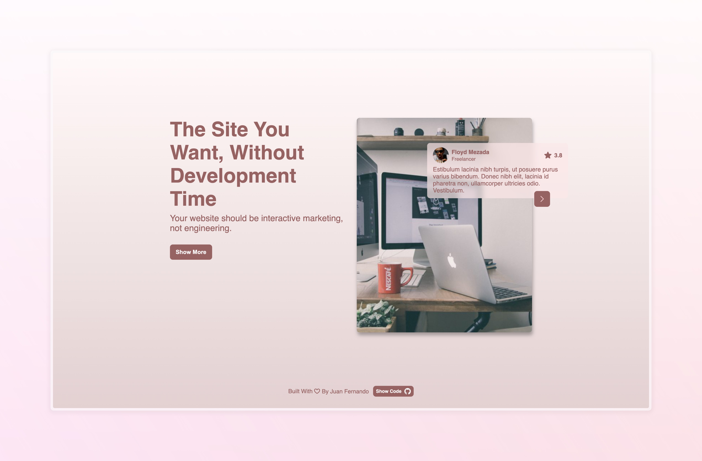

# Hero Animated

This project consists of developing a web page that replicates a provided layout. The main objective is to learn how to implement a carousel using HTML and CSS, as well as create animations for the entrance of the page. The page will include carousel functionality for scrolling between different sections of content. All code will be uploaded to GitHub for easy access and review.

## Requirments

You have complete all this:

- Customise the colours and design to your liking.
- Includes animations when entering the page.
- Includes carousel functionality.

### Extra Points

- Be organised with your code
- Gives good messages in commits

> **NOTE:** This project can only be built with CSS and HTML.

## Design

_Click on image to see preview_
